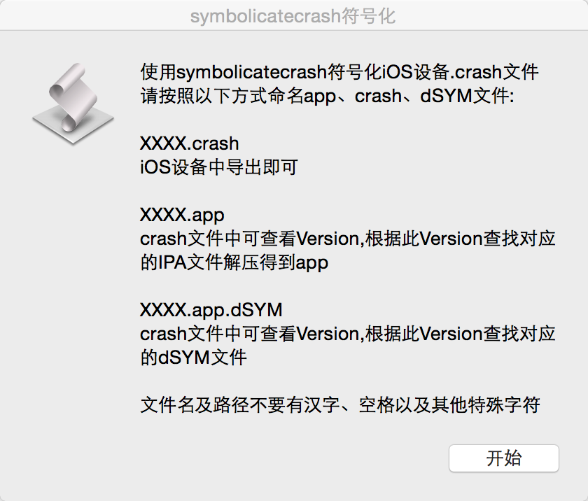
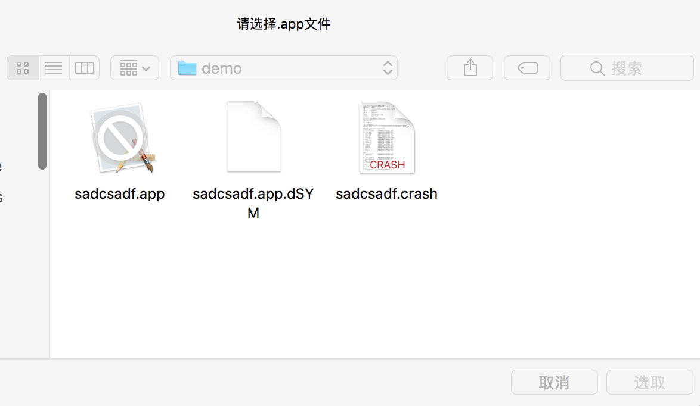

# ALSymbolicatecrash
Symbolicatecrash命令的封装方便使用

#### 使用步骤
1. Mac系统偏好设置 --> 安全性与隐私 --> 通用 --> 允许从以下位置下载的应用程
序: 任何来源
2. 双击symbolicatecrash.app运行,按照提示操作即可。

3. 【demo教程】选择ALSymbolicatecrash/demo目录下的sadcsadf.app、sadcsadf.app.dSYM、sadcsadf.crash进行测试

    

4. 最后ALSymbolicatecrash/demo/sadcsadf_symbol.txt即为我们符号化得到的结果。
